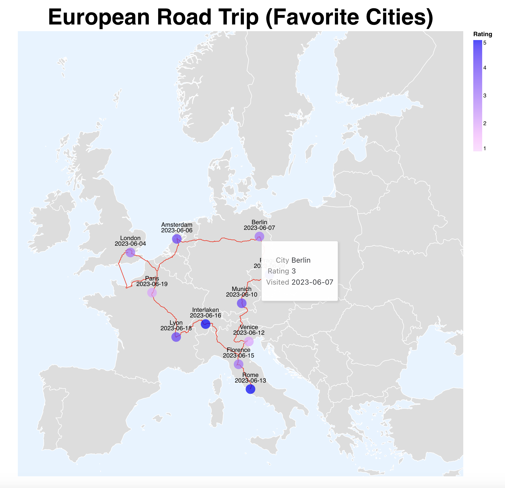

# map

I decided to illustrate the vacation I took in Europe a few years back.
The map shows the cities I went to and my personal rating for each city from 1-5, with 5 being the most enjoyable. More details such city name and the numerical rating can be seen via tooltips. The map also shows the route connecting the different cities and is an approximation of the route I took.

For the data, I used publically available geojson data for Europe along with a json file with individual city location data and my rating. The route was created using [brouter.de](brouter.de).
